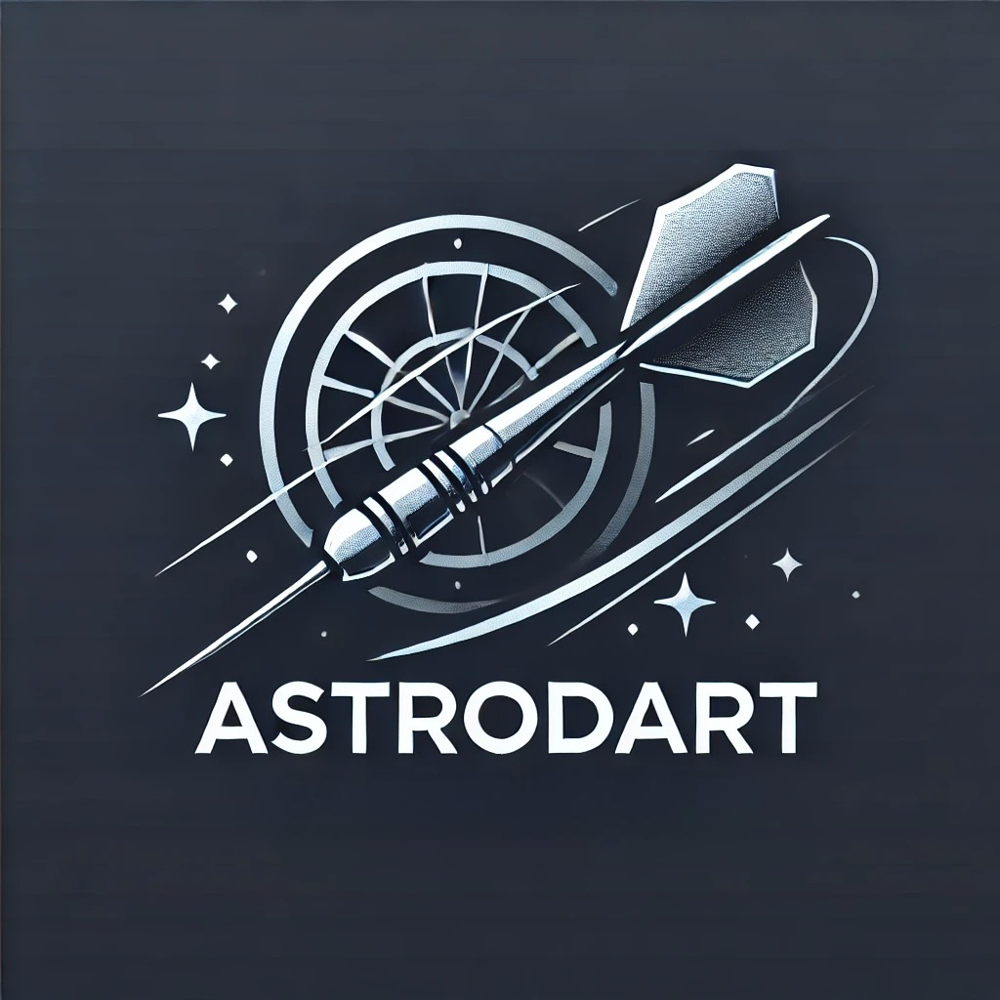

  

**Astro**nomical **DA**ta **R**eduction **T**ools
___

**AstroDART** is a collection of python tools for reduction of astronomical images taken with amateur or professional equipment. Allows for image alignment and combination for astrophotography uses and astrometry and photometry for more science oriented cases, like eclipsing binaries or exoplanet observations. 

## Documentation
Documentation can be accessed here: https://astrodart.readthedocs.io/en/latest/.

## Installation
Instructions for installation can be found here: https://astrodart.readthedocs.io/en/latest/installation.html.

## Usage
There are step by step guides for [photometry](https://astrodart.readthedocs.io/en/latest/photometry.html) and [astrophotography](https://astrodart.readthedocs.io/en/latest/astrophotography.html).

## Disclaimer

This package is different to that of [J. López-Cepero](https://link.springer.com/article/10.1007/s42496-023-00174-5). The name is shared by mere consequence and the objectives of each software are notably different with this one being more oriented to amateur astronomy, although with the capability of working with professional equipment as well.
